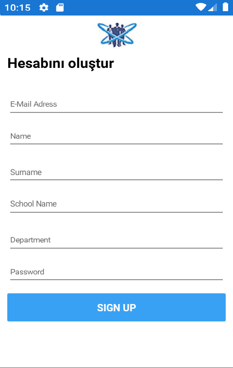
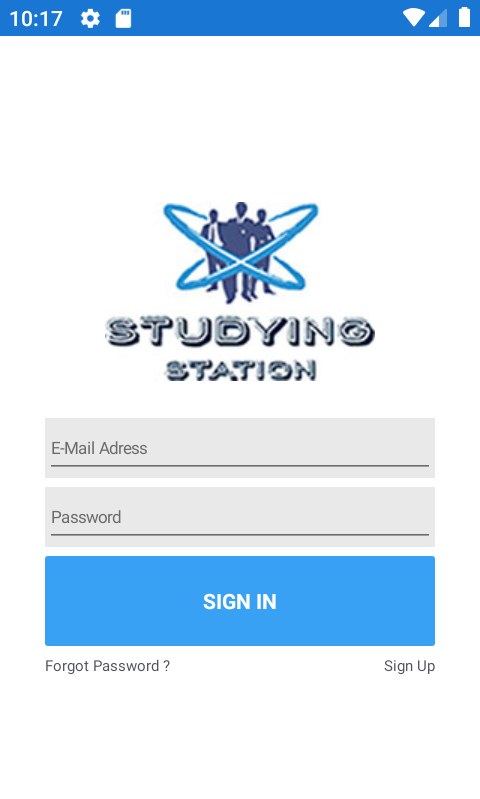
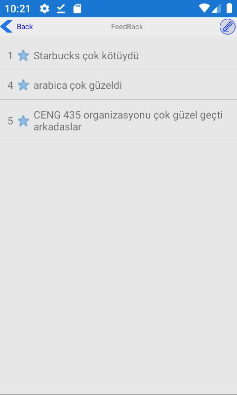
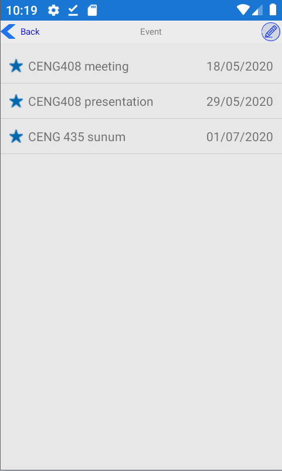
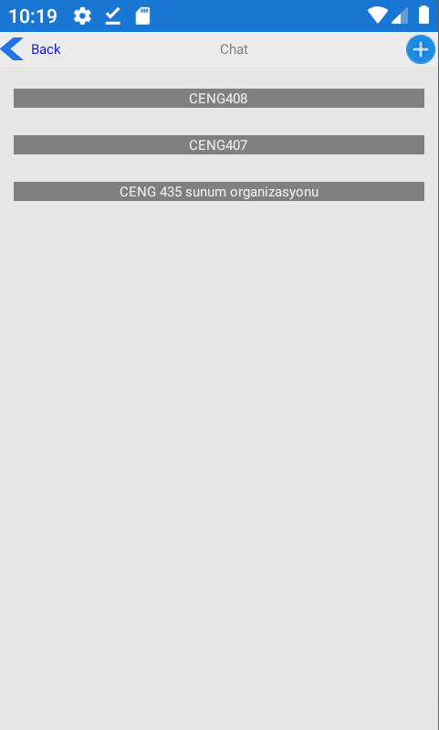
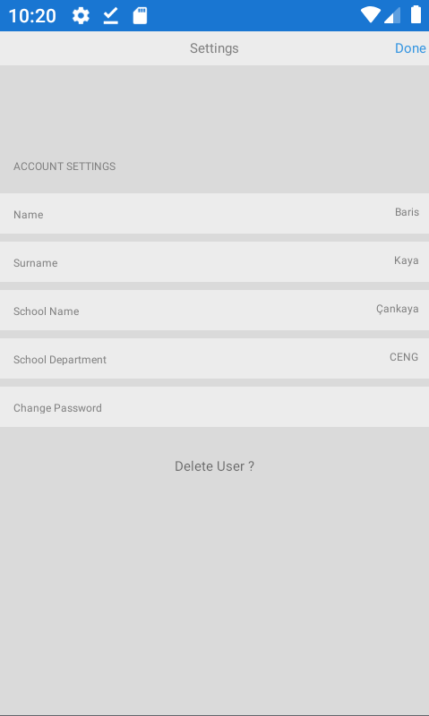

# Bachelor-s-Project
Studying Station Application

## ABSTRACT

It is a platform where people can see the appropriate environments and collective workplaces they are looking for. Thanks to the comments and points given by the people present or present in these environments, they can actively rate these environments and talk to each other through this platform.

## INRODUCTION

This study was carried out within the scope of the graduation project of Cankaya University Computer Engineering Department. The main purpose of the study is to provide benefit to the students by showing our programming skills. We have put forward the idea of this project based on the difficulties we face in our student life. The program will save students time and share information. You now have a common goal with students you do not know. To understand the course and to pass with good grades.

## Create new user

## Sign in

## Feedback

## Event

